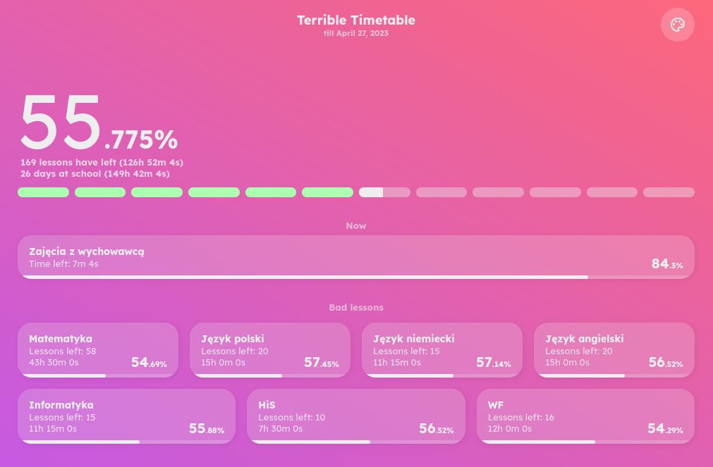

# Terrible Timetable

**Can't stand waiting for the end of the school year? Here's the solution which will help you survive a difficult period.**

App counts down literally everything related to lessons & wasted time at school.



_Those small progress bars indicate the full countdown divided into separate weeks_

# Installation
Simply, put all files in some web server directory.

App works even without Internet access, as all requirements are self-hosted (I just uploaded them to this repo tbh).

# Config
There is a file called `config.json`. This is where your terrible timetable is taken from.

**Section** `config`:
- `startDate` - This is the date when your terrible timetable starts in format `yyyy-mm-dd`.
- `endDate` - This is the date when your terrible timetable ends.
- `badLessons` - an array, subject names you want to have listed on main page
- `freeDays` -  list of free days you don't go to school, those will be ignored in the countdown

**Section** `timetable`:
This is an object containing arrays of lessons in specified day.

Empty timetable looks like this. Please note it **has to** start with Sunday:
```
...
"timetable": {
	"Sunday": [],
	"Monday": [],
	"Tuesday": [],
	"Wednesday": [],
	"Thursday": [],
	"Friday": [],
	"Saturday": []
}
...
```

A timetable entry should look like this (example with 2 lessons & a break between):
```
...
    "Monday": [
            {
                "name": "Matematyka",
                "starts": "8:00",
                "ends": "8:45"
            },
            {
                "name": "*Przerwa",
                "starts": "8:45",
                "ends": "8:50"
            },
            {
                "name": "Język polski",
                "starts": "8:50",
                "ends": "9:35"
            }
    ]
...
```
Where `name` is subject name,

`starts` & `ends` is time in format `HH:SS`

**Note:** `name` starting with `*` (like `*Long break`) won't be count as lesson.

**Note 2**: Breaks **are necessary to add**, otherwise total remaining time at school will not work.


# PRO Tip

To check if your setup is done well, simply change time & date on your device.

Make sure the countdown ends correctly on your desired end date. 

**...and don't forget to set the correct time back after finishing!**
